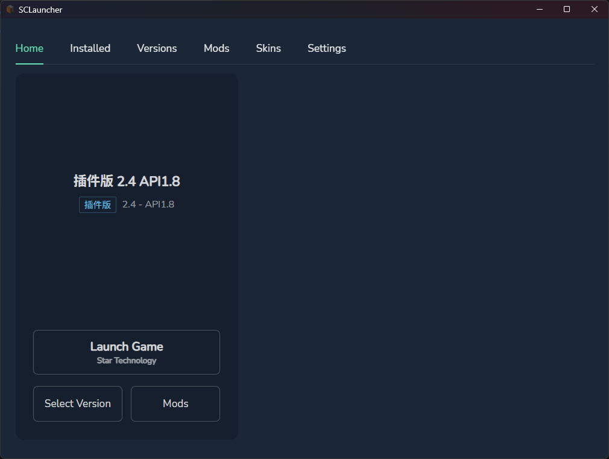
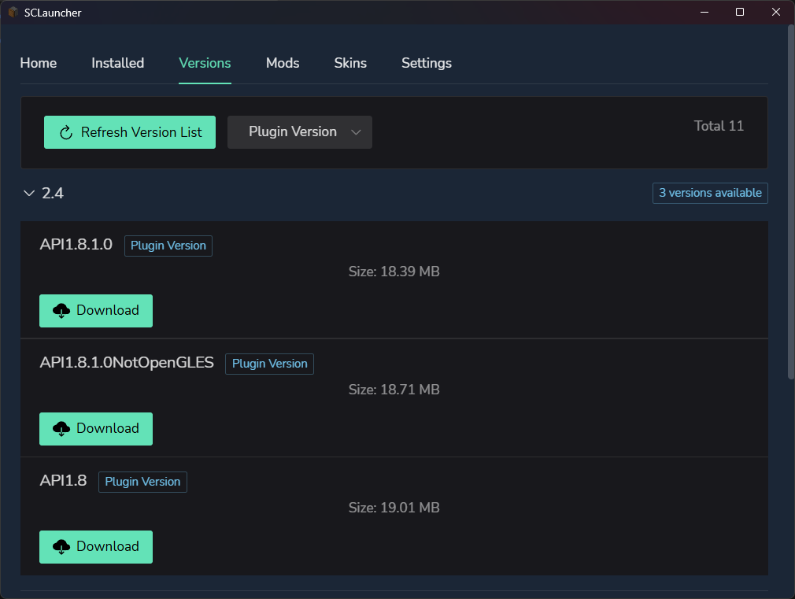
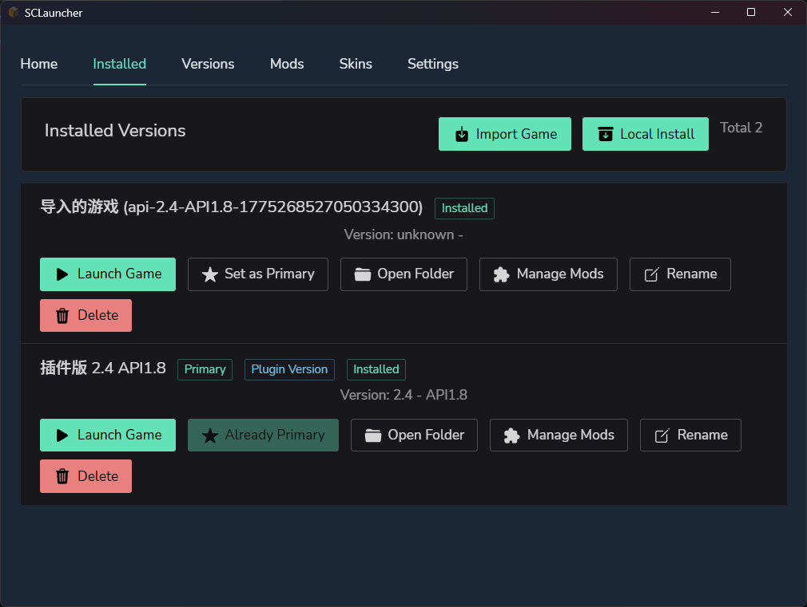
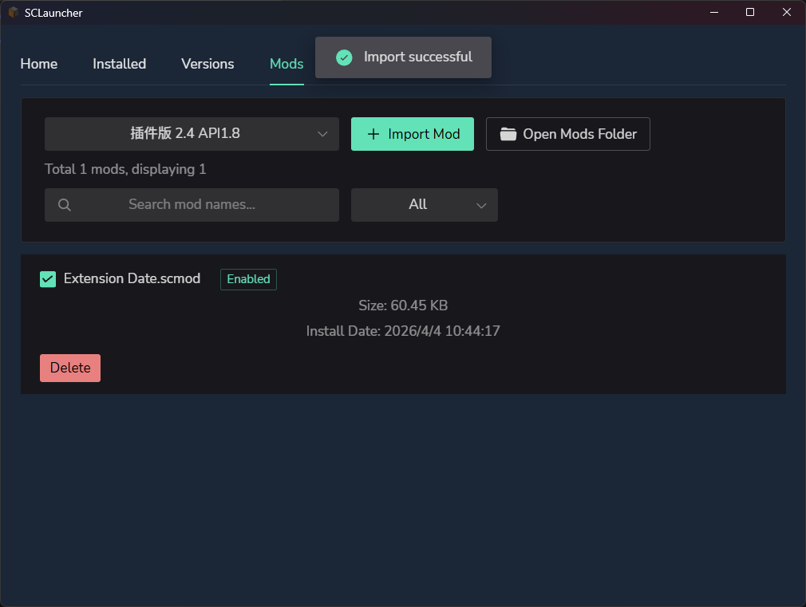

# SCLauncher - Survivalcraft Launcher

<div align="center">


A modern launcher for Survivalcraft game

[**简体中文**](docs/README_ZH.md) | **English**

</div>

## 📖 Project Introduction

SCLauncher is a modern launcher designed specifically for the game "Survivalcraft". It provides features such as version management, mod installation, skin management, and one-click launch, making game management simpler and more convenient.

### ✨ Features

#### 🎮 Core Features
- **One-Click Launch** - Quick game launch with multi-version management support
- **Version Management** - Install multiple game versions and switch between them easily
- **Version Download** - Automatically download game versions from manifest files with resume support
- **Mod Management** - Simple mod installation/uninstallation with enable/disable functionality
- **Skin Management** - Unified management of game skins, supporting `.scskin` format skin files
- **Import Game** - Import installed Survivalcraft game versions into the launcher for management
- **Multi-language Support** - Supports 7 languages (Chinese, English, Russian, Portuguese, Hindi, Indonesian, Arabic)
- **Smart Sync** - Automatically sync skins to game directory on launch using hard links to save space
- **Progress Display** - Real-time download and installation progress
- **Primary Version** - Set default launch version

#### 🎨 Interface Design
- **Clean & Modern** - Flat design with refreshing visual experience
- **Responsive Layout** - Adapts to different resolutions
- **Smooth Animations** - Delicate interactive experience
- **Dark Theme** - Eye-friendly dark interface

#### 🔧 Technical Features
- **Lightweight** - Small size, fast startup
- **High Performance** - Native performance, smooth experience
- **Data Persistence** - Local database, safe and reliable

## 📸 Preview Images

### Home Page


### Versions Management


### Version Download


### Mods Management


## 🚀 Quick Start

1. Download the latest version of SCLauncher exe file
2. First run will automatically detect system language and set interface language
3. Open "Settings" page to configure manifest file URL
4. Select and download game versions from "Versions Download" page
5. (Optional) Import game skin files in "Skin Management" page
6. Launch game from "Home" or "Installed Versions" page

## 📁 Directory Structure

```
SCLauncher/
├── versions/             # Game versions directory
│   └── [version_id]/    # Individual version directories
│       ├── game.exe     # Game executable
│       ├── data/        # Game data
│       ├── mods/        # Mods directory
│       ├── CharacterSkins/  # Game character skins (auto-synced)
│       └── doc/
│           └── CharacterSkins/  # Game doc skins (auto-synced)
├── Skins/               # Skin file storage directory (unified management)
│   └── *.scskin        # Skin files (actually PNG format)
└── downloads/            # Temporary download directory
```

## ⚠️ Important Notes

1. **First Use**: Need to configure manifest file URL before downloading game versions
2. **Network Connection**: Stable network connection required for downloading game versions
3. **Disk Space**: Ensure sufficient disk space for game files
4. **Version Isolation**: Each version is installed independently and does not affect others
5. **Mod Compatibility**: Pay attention to mod compatibility with game versions

## 🐛 FAQ

**Q: What to do if download fails?**
A: Check network connection and manifest file URL, try downloading again.

**Q: Game won't launch?**
A: Confirm game files are complete. You can open the folder in the installed versions page to check if files exist. It's also possible the provided game version files are incomplete, please provide feedback.

**Q: Mods not working?**
A: Confirm mods are enabled (checkbox checked) and compatible with the game version.

**Q: How to switch game versions?**
A: Select the version you want to launch from the home page or installed versions page, then click "Launch" button.

**Q: How to use skin feature?**
A: Click "Import Skin" in "Skin Management" page and select `.scskin` format skin files. Skins will be automatically synced to game directory when launching.

**Q: What is .scskin file?**
A: `.scskin` file is the skin file format for Survivalcraft game, actually a PNG image file. The launcher will automatically recognize and properly handle these files.

**Q: Where are skin files stored?**
A: All skin files are uniformly stored in the `Skins/` directory. Skin files in game directory are referenced via hard links (may downgrade to copy), saving disk space.

**Q: Which languages are supported?**
A: Currently supports 7 languages: Simplified Chinese, English, Russian, Portuguese (Brazil), Hindi, Indonesian, Arabic. The launcher will automatically select interface language based on system language, or you can manually change it in settings.

**Q: How to change interface language?**
A: Select your desired language in the "Language Settings" section of the "Settings" page. Changes take effect immediately.

**Q: How to import existing games?**
A: Click "Import Game" button in "Installed Versions" page and select the game folder containing Survivalcraft.exe. Imported game versions can be managed just like normally downloaded versions.

---

<div align="center">

**[⬆ Back to Top](#sclauncher---survivalcraft-launcher)**

Made with ❤️

</div>
